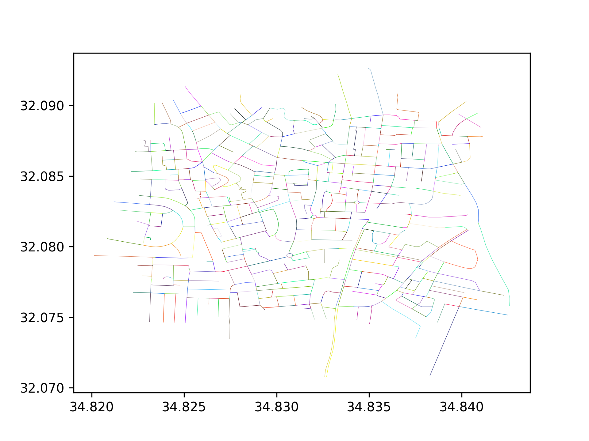
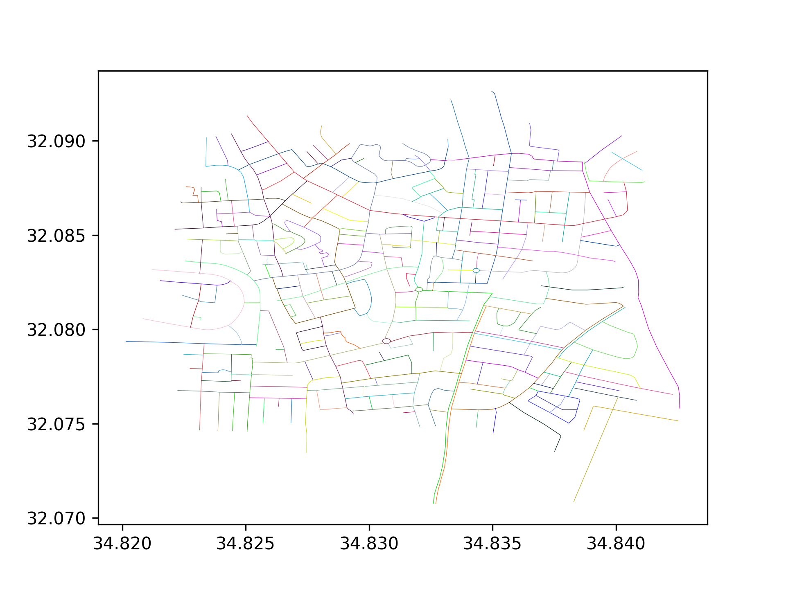

# Streets Colouring Algorithm
 
## Build
- python3 -m venv .env
- source .env/bin/activate
- pip install -r requirements.txt

## Example

### Before


<hr>

### After


## Usage
```bash
usage: main.py [-h] -i INPUT [-o OUTPUT] [-d DPI]

Streets Colouring Program

optional arguments:
  -h, --help            show this help message and exit
  -i INPUT, --input INPUT
                        Path to the input shapefile
  -o OUTPUT, --output OUTPUT
                        Path to the output directory
  -d DPI, --dpi DPI     Set the out image dpi
```
